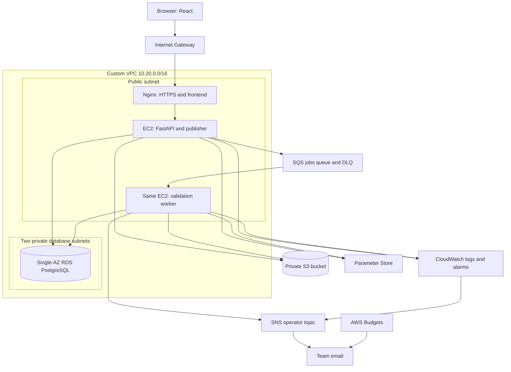
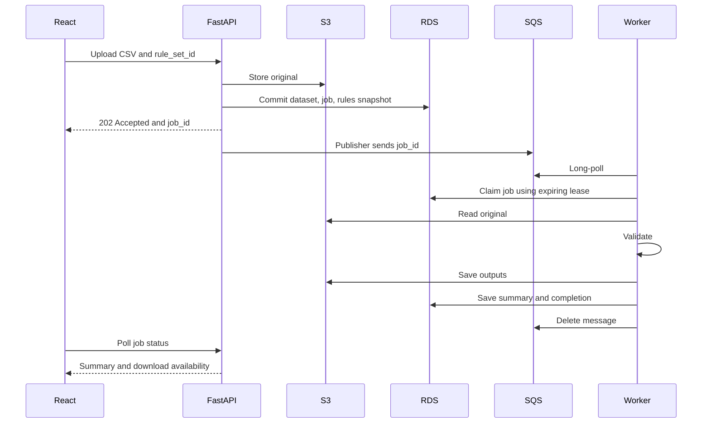
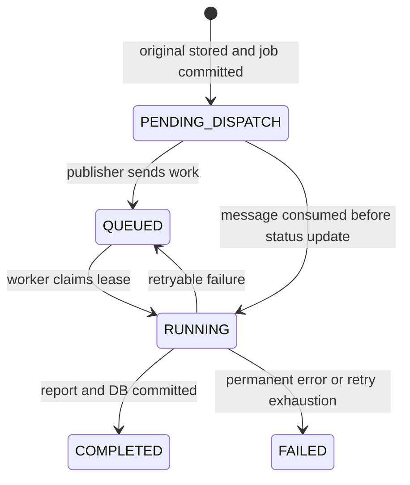

# DataGuard: Complete Three-Person Cloud Mini-Project Guide

> The React frontend is now implemented in `Frontend/`, with an interactive browser demo and a live API adapter. The backend and cloud sections below remain an implementation guide. No AWS resources have been created.

**Try the frontend:** run `npm.cmd install` and `npm.cmd run dev` from `Frontend/`, then open http://127.0.0.1:5173. See [Frontend/README.md](Frontend/README.md) for setup, demo behavior, verification, and backend integration. The response shapes expected by the frontend are documented in [docs/api-contract.md](docs/api-contract.md).

**Project:** Cloud-Based CSV Dataset Validation and Quality Reporting Platform.

**Stack:** React + Vite; Python 3.12 + FastAPI; PostgreSQL locally and Amazon RDS in AWS; EC2; S3; SQS; SNS; custom VPC; IAM; Systems Manager Parameter Store; CloudWatch; AWS Budgets.

**Schedule assumption:** Three students, at least one comfortable with Python, contributing about 1.5–2 hours each per working day. Aim for four weeks; allow another one or two weeks if everyone is learning backend development and AWS.

## Contents

1. [Scope](#1-scope)
2. [Guideline compliance](#2-guideline-compliance)
3. [Architecture](#3-architecture)
4. [Resources](#4-resources)
5. [Three-person division of work](#5-three-person-division-of-work)
6. [Schedule and checkpoints](#6-schedule-and-checkpoints)
7. [Repository structure](#7-repository-structure)
8. [Frontend](#8-frontend)
9. [Backend and database](#9-backend-and-database)
10. [Connect frontend and backend](#10-connect-frontend-and-backend)
11. [Validation engine](#11-validation-engine)
12. [Storage and reports](#12-storage-and-reports)
13. [Background jobs](#13-background-jobs)
14. [Budget and resource inventory](#14-budget-and-resource-inventory)
15. [Custom VPC](#15-custom-vpc)
16. [RDS setup](#16-rds-setup)
17. [S3, SQS, and SNS](#17-s3-sqs-and-sns)
18. [IAM and secure configuration](#18-iam-and-secure-configuration)
19. [EC2 deployment](#19-ec2-deployment)
20. [Monitoring and alarms](#20-monitoring-and-alarms)
21. [Verification](#21-verification)
22. [Troubleshooting](#22-troubleshooting)
23. [Demo](#23-demo)
24. [Submission](#24-submission)
25. [Cleanup](#25-cleanup)
26. [Learning resources](#26-learning-resources)

Read sections 1–7 together. Person A owns frontend work; B owns application/backend work; C owns cloud/integration work. Everyone participates in verification, demonstration, and submission.

## 1. Scope

### 1.1 User workflow

1. Register or log in.
2. Create a reusable rule set, or select a sample preset.
3. Upload a CSV and select the rule set.
4. Receive a job ID immediately while processing happens in the background.
5. Track waiting, running, completed, or failed status.
6. View a quality summary and failures by rule.
7. Download the original, valid rows, rejected rows with explanations, and JSON report.
8. Submit a corrected dataset as a new job and compare the summaries.

The baseline separates invalid rows; it does not invent missing values or silently change source data. Keep original values in exported rows. Use only synthetic demo data.

### 1.2 Five checks

| Check | Example | Failure behavior |
|---|---|---|
| Required columns | `student_id`, `name`, `age`, `department` | Dataset-level schema error |
| Required values | ID and name must not be blank | Reject affected rows |
| Unique values | ID unique within the uploaded file | Reject every occurrence of duplicated IDs |
| Numeric range | Age is an integer from 16 through 100 | Reject invalid values |
| Allowed values | Department is COMP, IT, or EXTC | Reject unexpected values |

Baseline limits: 5 MiB per file, 20,000 data rows, 50 columns, UTF-8 or UTF-8 with BOM, comma-separated CSV with one header row.

### 1.3 Required application features

- Hashed passwords and short-lived login tokens.
- Rule-set creation with server-side rule validation.
- Owner-specific job history and downloads.
- Background processing, persistent job status, and retry handling.
- Counts, per-rule explanations, valid/rejected exports, and a report.
- Application-generated operator notifications.
- Operational logs and an alarm.

Optional after completion: ISO date rules, PDF reports, job comparison screen, backup/restore demonstration, Infrastructure as Code, or CI/CD.

Leave Excel, AI correction, huge datasets, multiple worker servers, and complex administrator roles out of the first version. SQS and SNS already supply the required two additional cloud capabilities.

## 2. Guideline compliance

| Faculty condition | Implementation | Evidence |
|---|---|---|
| Frontend/backend/database | React, FastAPI, RDS PostgreSQL | Browser workflow and persistent records |
| Main compute is not completely serverless | API and worker on EC2 | Instance and running services |
| Custom VPC | Public application subnet, two private database subnets, routes, IGW, SGs | Network diagram and screenshots |
| Managed DB | Single-AZ RDS | RDS settings and queries |
| Genuine S3 use | Inputs, exports, reports | Objects produced by a job |
| Least-privilege IAM | Scoped EC2 role | Policy and role attachment |
| No embedded AWS credentials | Boto3 gets temporary role credentials | Source review and working calls |
| Secure configuration | Parameter Store SecureString | Masked parameter evidence |
| Monitoring and alarm | CloudWatch logs and queued-job-age alarm | Logs, alarm, notification |
| Budget/cost alert | AWS Budgets email | Budget and cost sheet |
| Five or more services | EC2, VPC, RDS, S3, IAM, SSM, CloudWatch, Budgets, SQS, SNS | Service justification |
| Two additional capabilities | SQS jobs and SNS operational notifications | Real queue and notification workflow |
| Beyond basic CRUD | Validation, quarantine, reports, recovery | Dirty-data and worker-recovery demos |
| Cloud areas | Compute, Networking, Database, Storage, Security/IAM, Monitoring | Labelled architecture |
| Submission artifacts | Diagram, source, evidence, costs, demo | Submission folder |
| Affordable deployment | Small EC2, Single-AZ RDS, no NAT Gateway or ALB | Resource inventory |
| Cleanup | Stop during short breaks; delete after assessment and exports | Cleanup record |

This design addresses the supplied conditions; faculty approval of the topic follows your normal submission process.

## 3. Architecture



Regional services such as S3/SQS are outside your subnet layout. EC2 accesses their HTTPS endpoints through its public-subnet Internet Gateway route. Database traffic stays inside the VPC. Private RDS subnets need no NAT Gateway for this design.

One EC2 is a student-project cost tradeoff, not a highly available deployment. If it fails, the API and worker are both unavailable until recovery; dispatched jobs remain in SQS.

### 3.1 Upload flow



Keep the publisher in the API process, separate from the worker. Pausing the worker must still allow jobs to reach the queue.

## 4. Resources

### 4.1 Laptop tools

| Tool | Purpose | Check |
|---|---|---|
| Python 3.12 | Backend and worker | `py -3.12 --version` on Windows |
| Node compatible with current Vite | React tools | `node --version`, `npm --version` |
| Git and editor | Collaboration | `git --version` |
| PostgreSQL 16 locally | Development DB | pgAdmin or `psql` |
| AWS CLI v2 | Cloud owner diagnostics | `aws --version` |
| SSH | EC2 access | `ssh -V` |
| Browser | UI and Network tab | Chrome, Edge, Firefox |
| Optional Postman | API requests | FastAPI `/docs` is enough initially |
| Optional Docker Desktop | Alternative local DB | Not needed for cloud baseline |

Use a stable Node release compatible with Vite. Its current guide lists Node 20.19+ or 22.12+ minimums; verify the template requirement when installing. [Vite guide](https://vite.dev/guide/)

### 4.2 Shared resources

- Private Git repository with all three members.
- AWS account/lab access, credits, and individual permitted identities.
- MFA where account policy permits; do not share root credentials.
- One agreed region used for all project services.
- Operator email inbox for SNS confirmation.
- Task board and resource inventory.
- Architecture editor, or Mermaid diagrams from this guide.
- Optional existing domain for browser-trusted HTTPS.

Check early whether the lab permits RDS, IAM roles, SNS, and Parameter Store. A pre-created lab role may be required. If restrictions prevent a mandatory condition, discuss that with faculty before investing in the cloud deployment.

### 4.3 Dependencies

Backend: `fastapi`, `uvicorn`, `pandas`, `python-multipart`, `sqlalchemy`, `psycopg[binary]`, `alembic`, `pydantic-settings`, `boto3`, `pwdlib[argon2]`, `PyJWT`, `pytest`, `httpx`.

Frontend: React and Vite. Start with native `fetch`; add a chart library only if your dashboard needs it. Pandera is optional; explicit Pandas checks are sufficient.

## 5. Three-person division of work

| Owner | Area | Deliverables |
|---|---|---|
| A: frontend | Screens and browser integration | Login, rule form, upload, history, details, reports, downloads |
| B: backend | Application and data behavior | Contract, auth, migrations, validation, outputs, ownership |
| C: cloud/integration | AWS and deployment | Adapters, worker integration, VPC, IAM, resources, deployment, monitoring, costs |

### A: frontend checklist

- [ ] Agree on API fields with B before connecting screens.
- [ ] Build screens with sample responses.
- [ ] Use one API helper and relative `/api` paths.
- [ ] Keep login token in React memory; handle expiry.
- [ ] Use FormData for uploads.
- [ ] Poll jobs and stop on terminal status/unmount.
- [ ] Show loading, empty, failure, and completed states.
- [ ] Show accurate row counts and explanations.
- [ ] Implement authenticated downloads and responsive layout.
- [ ] Produce the deployment build and demo screenshots.

### B: backend checklist

- [ ] Define endpoints, schema, status names, and error format.
- [ ] Implement health endpoints and migrations.
- [ ] Implement hashed passwords, token checks, and resource ownership.
- [ ] Validate rules server-side and save immutable job snapshots.
- [ ] Parse CSVs and enforce deterministic validation semantics.
- [ ] Enforce file/row/column limits and safe storage keys.
- [ ] Generate valid/rejected outputs and reports.
- [ ] Coordinate dispatch/leases/idempotency with C.
- [ ] Verify core rules, owner checks, and recovery.

### C: cloud/integration checklist

- [ ] Check credits, permissions, region, and budget.
- [ ] Implement storage/queue adapters with B's interfaces.
- [ ] Create network and private RDS setup.
- [ ] Create S3, SQS/DLQ, SNS, IAM, and parameters.
- [ ] Deploy API and worker as separate services.
- [ ] Serve frontend through Nginx; configure HTTPS.
- [ ] Send logs to CloudWatch and configure an alarm.
- [ ] Verify queue recovery with A and B.
- [ ] Maintain inventory, cost sheet, and evidence.
- [ ] Clean up after assessment and necessary exports.

### Working agreements

1. A and B freeze API examples early.
2. B owns rule semantics; B/C review the worker together.
3. Use small feature branches and reviewed pull requests.
4. Commit migrations and dependency lock files with each relevant change.
5. Never commit secrets, `.env`, private keys, or real personal data.
6. Hold a 10-minute daily check of working features, blockers, and interface changes.
7. After about 45 minutes on an unexplained error, reproduce it with another member. Change one setting at a time.

## 6. Schedule and checkpoints

| Week | A | B | C | Checkpoint |
|---|---|---|---|---|
| 1 | Screens against sample JSON | Validator, API skeleton, local DB | Permissions/costs, adapter design | Dirty CSV produces an accurate local report |
| 2 | Connect login/rules/upload/history | Auth, reports, persistent jobs | Local worker, AWS adapters | Full browser workflow works locally |
| 3 | Integration fixes, production build | RDS migration, recovery logic | AWS network/resources/deployment | Full AWS workflow works |
| 4 | Polish, screenshots | Behavior and authorization checks | Logs, alarms, costs, cleanup rehearsal | Submission and demo ready |

Working-day sequence:

1. Agree on scope, names, roles, sample data, and repository.
2. Freeze API and validation semantics.
3. Implement local validator and screen skeletons.
4. Add database models/migrations.
5. Demonstrate local upload/report.
6. Implement login/ownership.
7. Connect React rules/upload.
8. Implement outputs/downloads.
9. Add separate worker and durable states.
10. Complete local browser milestone.
11. Create budget/VPC/subnets/Security Groups.
12. Create EC2/RDS and verify connectivity.
13. Create S3/SQS/SNS/IAM/parameters.
14. Deploy API/worker with AWS adapters.
15. Deploy frontend/Nginx/HTTPS.
16. Configure logs/alarm.
17. Verify retries and paused-worker recovery.
18. Check ownership, limits, malformed inputs.
19. Prepare diagram/evidence/costs.
20. Rehearse and fix remaining issues.

Do not postpone the first AWS database connection until the final week. Finish checkpoints before optional features.

## 7. Repository structure

Create this structure as you implement; this guide alone does not create the listed files.

```text
DataGuard/
  README.md
  .gitignore
  frontend/
    package.json
    package-lock.json
    vite.config.js
    src/
      App.jsx
      api.js
      components/
      pages/                 # Login, Rules, Upload, History, JobDetails
  backend/
    requirements.txt
    .env.example
    alembic.ini
    migrations/
    app/
      __init__.py
      main.py
      config.py
      database.py
      models.py
      schemas.py
      auth.py
      routers/               # auth, rules, jobs
      services/              # validator, reports, storage, dispatcher
      worker.py
      seed.py
    tests/
    runtime/                 # ignored local files/logs
  samples/                   # good, dirty, malformed, missing-column CSVs
  deploy/                    # Nginx, systemd, CloudWatch agent config
  docs/
    api-contract.md
    architecture.md
    service-justification.md
    costs.md
    resource-inventory.md
    demo-script.md
    evidence/                # redacted screenshots
```

Create one private repository using your Git hosting UI; invite the team and clone it. Keep one repository root, not nested repositories.

Suggested `.gitignore`:

```gitignore
.env
.env.*
!.env.example
.venv/
__pycache__/
.pytest_cache/
node_modules/
dist/
backend/runtime/
*.pem
*.key
*.log
```

Commit `package-lock.json`, Python dependency versions, and migrations. If a secret is committed, rotate it; deleting the latest copy does not invalidate the exposed value.

Conventions: `/api` prefix; UUID identifiers; UTC timestamps; 3-second active-job polling; maximum 100 preview errors; 30-minute access tokens; AWS names beginning `dataguard-`.

## 8. Frontend

**Owner: A. Dependency: agreed API contract from B.**

### 8.1 Create the React project

From the repository root, only if `frontend` does not already contain a project:

```powershell
npm create vite@latest frontend -- --template react
Set-Location frontend
npm install
npm run dev
```

Open the URL printed by Vite, normally `http://localhost:5173`. Keep the generated lock file. Teammates installing an existing checkout use `npm ci`, not the scaffolding command again.

### 8.2 Screen requirements

| Screen | Controls | API integration | Important UI behavior |
|---|---|---|---|
| Login/register | Email, password, submit | Auth endpoints | Loading, invalid login, expired session |
| Dashboard/history | Recent jobs, status filter | List jobs | Empty state and pagination |
| Rules | Rule-set name, columns, bounds, permitted values | Create/list rule sets | Explain comma-separated value entry and invalid ranges |
| Upload | Title, file selector, rule-set dropdown | Create job | Disable duplicate clicks; enforce client-side size hint |
| Job details | Status, timestamps, refresh | Get job | Poll active states; stop on completed/failed |
| Report | Counts, per-rule failures, error preview | Get report | Distinguish bad data from processing failure |
| Downloads | Original, valid rows, rejected rows, JSON | Get download URL | Only show available artifacts |

Build the table and counts before charts. A labelled bar showing valid/rejected rows is enough for the baseline. Explain that one rejected row can fail multiple rules; failure counts need not sum to rejected-row count.

### 8.3 Build against a sample response

B should save response examples in `docs/api-contract.md`. A can use those objects as temporary component data. Replace them with the API helper after the health connection works.

Do not let A invent `jobId` while B returns `job_id`. Agree on snake_case fields in responses and use them consistently.

### 8.4 Production build

```powershell
npm run build
```

Expected output: `frontend/dist/`. Deploy these files through Nginx. The Vite development server is for laptop development, not the final EC2 web server.

## 9. Backend and database

**Owner: B. C helps with the storage and queue interfaces.**

### 9.1 Create the environment

Create the `backend` directory and indicated Python files in your editor. From `backend` on Windows:

```powershell
py -3.12 -m venv .venv
.\.venv\Scripts\python.exe -m pip install --upgrade pip
.\.venv\Scripts\python.exe -m pip install fastapi uvicorn pandas python-multipart sqlalchemy "psycopg[binary]" alembic pydantic-settings boto3 "pwdlib[argon2]" PyJWT pytest httpx
```

After the first working build, save exact installed package versions into `requirements.txt` using your editor or dependency tooling. Teammates use:

```powershell
.\.venv\Scripts\python.exe -m pip install -r requirements.txt
```

The explicit interpreter avoids Windows activation-policy problems. Run all backend commands from `backend` unless stated otherwise.

### 9.2 Start with health endpoints

Implement `app/main.py` with a FastAPI app and routes:

```python
from fastapi import FastAPI

app = FastAPI(title="DataGuard API")

@app.get("/api/health")
def health():
    return {"status": "ok", "service": "dataguard-api"}
```

Run locally:

```powershell
.\.venv\Scripts\python.exe -m uvicorn app.main:app --reload --host 127.0.0.1 --port 8000
```

Check `http://127.0.0.1:8000/api/health` and `http://127.0.0.1:8000/docs`.

Later add `/api/ready`: run `SELECT 1` against PostgreSQL, return 200 when usable and 503 otherwise. Do not include the DB password, connection string, or traceback in health responses.

### 9.3 Local PostgreSQL setup

Install PostgreSQL 16 using its official installer. In pgAdmin, connect with your local administrative account. Create:

1. Login role `dataguard_app`, with a new local-only password.
2. Database `dataguard`, owned by `dataguard_app`.
3. Confirm the application role can connect and create its own tables in that database.

Use local PostgreSQL through the whole first milestone. An RDS instance need not run while you are creating screens.

### 9.4 Local configuration

Create `backend/.env.example` with placeholders and a separate ignored `backend/.env` with actual local values:

```dotenv
APP_ENV=local
DB_HOST=127.0.0.1
DB_PORT=5432
DB_NAME=dataguard
DB_USER=dataguard_app
DB_PASSWORD=replace-with-local-password
DB_SSLMODE=disable
JWT_SECRET=replace-with-random-local-secret
JWT_EXPIRE_MINUTES=30
STORAGE_MODE=local
QUEUE_MODE=database
LOCAL_STORAGE_ROOT=runtime/storage
MAX_UPLOAD_BYTES=5242880
MAX_CSV_ROWS=20000
MAX_CSV_COLUMNS=50
```

Generate a local secret, copy it into the ignored file, and do not put its output into evidence:

```powershell
.\.venv\Scripts\python.exe -c "import secrets; print(secrets.token_urlsafe(48))"
```

Implement settings with `pydantic-settings`, loading `.env` only in local mode. Validate required settings on startup. AWS mode retrieves secrets from Parameter Store, not committed defaults.

Use `sqlalchemy.URL.create("postgresql+psycopg", ...)` with separate host/user/password values. It handles special characters in passwords more reliably than manually assembling a URL. Create a small connection pool, such as pool_size 2/max_overflow 1 per API or worker process; enable `pool_pre_ping`.

### 9.5 Database tables

Use SQLAlchemy models and Alembic migrations. JSONB stores compact rules and report summaries, not entire uploaded datasets.

| Table | Main fields | Constraints/meaning |
|---|---|---|
| users | id, email, password_hash, created_at | UUID PK; normalized email UNIQUE; no plaintext password |
| rule_sets | id, owner_id, name, rules_json, created_at | FK to users; owner required |
| datasets | id, owner_id, original_name, storage_key, size_bytes, created_at | Original name is metadata, not a storage path |
| jobs | id, owner_id, dataset_id, rule_set_id, rules_snapshot, status, attempts, lease_until, last_dispatched_at, summary_json, artifacts_json, error_code, error_message, failure_kind, created_at, started_at, completed_at | FK relations; rules frozen at submission |
| notification_events | id, job_id, event_type, status, attempts, created_at | UNIQUE(job_id, event_type); durable best-effort SNS publishing |

Add an index on jobs(owner_id, created_at), and another on jobs(status, lease_until). Store timestamps with time zone. Do not expose `password_hash`, internal S3 keys, or leases in normal UI responses.

Initialize migrations once after creating models:

```powershell
.\.venv\Scripts\python.exe -m alembic init migrations
```

Configure Alembic's `env.py` to import model metadata and build the connection from application settings. Avoid storing passwords in `alembic.ini`. Then:

```powershell
.\.venv\Scripts\python.exe -m alembic revision --autogenerate -m "initial schema"
.\.venv\Scripts\python.exe -m alembic upgrade head
```

Review generated migrations before running them. Teammates run `upgrade head` after pulling; they do not regenerate the initial migration. Execute cloud migrations once during deployment, not independently from API and worker startup.

### 9.6 Authentication and authorization

1. Normalize email and reject duplicates.
2. Hash passwords with Argon2 using `pwdlib`; never log them.
3. Login verifies the stored hash.
4. Return a signed token containing user ID as `sub`, issue time, and expiry.
5. Verify expiry and explicitly permit the selected JWT algorithm, e.g. HS256.
6. Each protected endpoint derives the user from the validated token.
7. Query rule sets, jobs, reports, and artifacts by both resource ID and owner ID.
8. Return 404 for another user's resource rather than revealing it exists.

For this baseline, keep access tokens in React memory. Reloading requires another login. Use HTTPS in the cloud before sending real passwords/tokens. A later cookie-based session design needs its own CSRF and cookie configuration.

Reference: [FastAPI hashing and JWT tutorial](https://fastapi.tiangolo.com/tutorial/security/oauth2-jwt/). Your JSON login contract below differs from that tutorial's OAuth form example; adapt deliberately.

### 9.7 API contract

Save this contract in `docs/api-contract.md` and update it through agreed changes.

| Method/path | Input | Success | Owner |
|---|---|---|---|
| GET `/api/health` | None | 200 status | B |
| GET `/api/ready` | None | 200 DB usable / 503 unavailable | B |
| POST `/api/auth/register` | JSON email/password | 201 user id/email | B |
| POST `/api/auth/login` | JSON email/password | 200 access_token/token_type | B |
| GET `/api/auth/me` | Bearer token | 200 id/email | B |
| POST `/api/rule-sets` | JSON name/rules | 201 rule-set id and rules | B |
| GET `/api/rule-sets` | Bearer token | 200 user's rule sets | B |
| POST `/api/jobs` | Multipart title, rule_set_id, file | 202 job_id/status | B/C |
| GET `/api/jobs?limit=20&offset=0` | Bearer token | 200 items/total | B |
| GET `/api/jobs/{job_id}` | Bearer token | 200 status/summary/error | B |
| GET `/api/jobs/{job_id}/report` | Bearer token | 200 completed report | B |
| GET `/api/jobs/{job_id}/downloads/{kind}` | Bearer token; original/valid/rejected/report | 200 url/expires_in | B/C |

The upload handler verifies rule-set ownership, file limit, CSV extension, and safe basic header parsing; stores the original; commits the dataset and job; returns 202. Detailed row validation belongs to the worker.

Example rule-set request:

```json
{
  "name": "Student Records",
  "rules": {
    "required_columns": ["student_id", "name", "age", "department"],
    "required_values": ["student_id", "name", "age", "department"],
    "unique_columns": ["student_id"],
    "numeric_ranges": {"age": {"min": 16, "max": 100, "integer": true}},
    "allowed_values": {"department": ["COMP", "IT", "EXTC"]}
  }
}
```

Reject empty rule names, conflicting min/max, unsupported types, and rules referring to invalid/reserved column names. Require every referenced rule column to be included in `required_columns`.

Example accepted upload response:

```json
{"job_id": "example-uuid", "status": "PENDING_DISPATCH"}
```

Example completed status response:

```json
{
  "job_id": "example-uuid",
  "title": "Student records audit",
  "status": "COMPLETED",
  "created_at": "2026-09-30T08:00:00Z",
  "completed_at": "2026-09-30T08:00:05Z",
  "summary": {
    "total_rows": 6,
    "valid_rows": 2,
    "rejected_rows": 4,
    "valid_percentage": 33.33
  },
  "available_downloads": ["original", "valid", "rejected", "report"],
  "error": null
}
```

Use one structured error shape for HTTP exceptions, request validation failures, and unexpected errors:

```json
{"error": {"code": "FILE_TOO_LARGE", "message": "Upload a CSV of 5 MiB or less."}}
```

401 = invalid/expired token; 404 = missing or unauthorized resource; 413 = upload limit; 422 = invalid request/rules/early CSV checks; 409 = report not ready; 503 = dependency unavailable. If you keep FastAPI's default 422 shape instead, explicitly normalize it in the frontend helper.

## 10. Connect frontend and backend

**Owners: A/B locally; C handles the deployed reverse proxy.**

### 10.1 Use the same API path everywhere

Local flow: browser requests `http://localhost:5173/api/...`; Vite forwards it to FastAPI at `127.0.0.1:8000`.

Cloud flow: browser requests `https://your-demo-host/api/...`; Nginx forwards it to FastAPI at `127.0.0.1:8000` on EC2.

The browser sees one origin in each environment. This avoids needing CORS in the baseline and avoids changing API URLs between development and production.

### 10.2 Configure the local proxy

Edit `frontend/vite.config.js`:

```javascript
import { defineConfig } from 'vite';
import react from '@vitejs/plugin-react';

export default defineConfig({
  plugins: [react()],
  server: {
    port: 5173,
    strictPort: true,
    proxy: {
      '/api': { target: 'http://127.0.0.1:8000', changeOrigin: true }
    }
  }
});
```

Restart Vite after changing configuration. Keep the `/api` prefix; do not rewrite it away because FastAPI routes include it. [Vite proxy reference](https://vite.dev/config/server-options)

### 10.3 Create one API helper

Example `frontend/src/api.js`:

```javascript
export async function apiRequest(path, { token, body, headers, ...options } = {}) {
  const requestHeaders = new Headers(headers);
  if (token) requestHeaders.set('Authorization', `Bearer ${token}`);
  if (body !== undefined && !(body instanceof FormData)) {
    requestHeaders.set('Content-Type', 'application/json');
    body = JSON.stringify(body);
  }
  const response = await fetch(`/api${path}`, {
    ...options, headers: requestHeaders, body
  });
  const data = await response.json().catch(() => ({}));
  if (!response.ok) {
    const error = new Error(data.error?.message || `Request failed (${response.status})`);
    error.status = response.status;
    error.code = data.error?.code;
    throw error;
  }
  return data;
}
```

The helper expects JSON responses, including the download-URL response. Handle 401 by clearing the in-memory session and showing login. Do not retry rejected uploads blindly because you may create another job.

### 10.4 Verify health first

With API and Vite running, call:

```javascript
const health = await apiRequest('/health');
console.log(health.status);
```

In the browser Network tab, verify the URL starts with the frontend host and `/api/health`, and the response is 200 JSON. This proves the connection before auth, uploads, or AWS enter the picture.

### 10.5 Login and upload

```javascript
const login = await apiRequest('/auth/login', {
  method: 'POST', body: { email, password }
});
// Store login.access_token in React context/state.

const form = new FormData();
form.append('title', title);
form.append('rule_set_id', selectedRuleSetId);
form.append('file', selectedFile);
const accepted = await apiRequest('/jobs', {
  method: 'POST', token, body: form
});
```

Do not set `Content-Type` manually for FormData: the browser adds the required multipart boundary. The FastAPI endpoint must use `UploadFile`/`File` for the file and `Form` for title/rule_set_id. [FastAPI upload reference](https://fastapi.tiangolo.com/tutorial/request-files/)

### 10.6 Poll and download

Poll `/jobs/{job_id}` every 3 seconds only while status is PENDING_DISPATCH, QUEUED, or RUNNING. Use a request-then-timeout loop, not overlapping interval requests. Cancel on screen exit with AbortController. Stop and show an actionable error when authentication expires or the resource disappears.

For an output:

```javascript
const result = await apiRequest(`/jobs/${jobId}/downloads/rejected`, { token });
window.location.assign(result.url);
```

AWS mode returns a 60-second S3 presigned download URL, generated only after ownership checks. Local mode may return a short-lived signed API download URL, validated server-side, or use an authenticated streamed-download helper. Never bypass ownership just to make a plain link work.

### 10.7 If teammates run servers on different laptops

For a trusted local network only, B binds Uvicorn to `0.0.0.0` and allows port 8000 through the local firewall for that network. A points the Vite proxy to B's LAN IP, not `localhost`. `localhost` always refers to the machine running that process. Prefer each teammate running the full local stack when practical.

If you deliberately call port 8000 directly from the browser, configure FastAPI CORSMiddleware with the precise frontend origin. Ports and protocols are part of the origin. CORS is a browser rule, not a substitute for authentication. [FastAPI CORS guide](https://fastapi.tiangolo.com/tutorial/cors/)

Never put DB credentials, AWS keys, or JWT signing secrets in React variables, including `VITE_*`; frontend configuration is visible to users.

## 11. Validation engine

**Owner: B. A uses its report schema; C calls it from the worker.**

### 11.1 Deterministic parsing

1. Read bytes with an enforced limit, not an unlimited `file.read()`.
2. Decode UTF-8 with optional BOM; return a clear error for unsupported encoding.
3. Inspect headers with Python's CSV parser before Pandas can rename duplicate headers.
4. Trim surrounding whitespace from header names and reject blank/duplicate headers after trimming.
5. Reject headers beginning `__dg_`, reserved for output annotations.
6. Parse a comma-separated file using string values, e.g. `dtype=str, keep_default_na=False`, with malformed lines treated as errors.
7. Apply row/column limits after parsing; constrain any optional CSV preview too.
8. Reject zero-data-row files with `EMPTY_DATASET`.
9. Confirm the required columns exist.
10. Evaluate each rule and collect all applicable errors per row.

For stricter CSV structure, pre-scan records with Python's `csv.reader` and require each record to have exactly the header's field count; preserve quoted commas/newlines. Do not silently skip malformed lines.

The string approach preserves values such as leading-zero IDs and literal `NA`. Use trimmed values for checks; keep the original strings in exports. Allowed values and unique IDs are case-sensitive in the baseline. State that in the form help text.

### 11.2 Rule implementation

- Required value: trimmed value is an empty string.
- Unique value: check duplicates with `keep=False`; all duplicate occurrences are rejected.
- Numeric: convert a temporary series with `pandas.to_numeric(errors="coerce")`; reject conversion failures and non-finite values; enforce min/max and integer requirement.
- Allowed value: compare trimmed values to the configured list.
- Missing column: report a dataset-level schema failure, zero valid rows, and all rows rejected; annotate each row with the missing-column reason. This is a completed audit with bad data, not an infrastructure failure.

Use stable rule codes, e.g. REQUIRED_VALUE, DUPLICATE_VALUE, NUMERIC_RANGE, ALLOWED_VALUE, MISSING_COLUMN. Preserve one row's multiple explanations. Count failures by rule separately from rejected rows.

### 11.3 Dirty demo file

Create `samples/students_dirty.csv`:

```csv
student_id,name,age,department
S001,Asha,20,COMP
S002,,21,IT
S003,Rohan,15,COMP
S003,Meera,22,COMP
S005,Ishan,19,MECH
S006,Neha,23,IT
```

With the sample rule set in section 9:

- 6 total rows; 2 valid rows; 4 rejected rows.
- Missing name: 1 row.
- Duplicate ID: 2 rows, including both S003 records.
- Invalid age: 1 row; that row also has a duplicate ID.
- Invalid department: 1 row.
- Valid percentage: 33.33%.

The sum of individual failure counts is 5 because one row fails twice. This is expected.

Create the good file by giving S002 a name, changing age 15 to 20, changing the second S003 to S004, and changing MECH to EXTC. Expected: 6 valid, 0 rejected.

### 11.4 Additional fixtures

| File | Purpose | Expected behavior |
|---|---|---|
| Missing `department` header | Required-column check | Completed schema-failure report; all rows rejected |
| Header only | Empty dataset | Failed input job or early 422, as documented |
| Broken quoting/wrong record width | Parser handling | Actionable MALFORMED_CSV error |
| Duplicate headers | Ambiguous schema | Early 422 rejection |
| Leading-zero IDs | String preservation | IDs remain unchanged |
| Literal `NA` | Missing-value policy | Does not automatically become blank |
| Oversized upload | Size enforcement | 413; no queued job |
| Too many rows | Worker limit | Failed with ROW_LIMIT_EXCEEDED |

### 11.5 Focused verification

Write meaningful tests for the dirty-file counts, duplicate semantics, missing columns, preserved IDs, multiple errors, malformed input, and numeric edge cases. These checks validate the central project behavior; do not spend time testing every visual component.

## 12. Storage and reports

**Owners: B defines artifacts; C implements storage adapters.**

### 12.1 One storage interface

Implement methods such as `save_bytes(key, data)`, `read_bytes(key)`, `delete_object(key)`, and `get_download_url(key, filename, ttl)`.

- Local mode uses ignored `backend/runtime/storage` and safely resolves keys under that directory.
- AWS mode uses Boto3 and one private S3 bucket.
- API and worker use the same settings and backend directory locally.
- Production has no silent fallback to local storage if S3 fails.

S3 keys use generated IDs, not user-controlled filenames:

```text
uploads/{owner_id}/{dataset_id}/original.csv
outputs/{owner_id}/{job_id}/valid.csv
outputs/{owner_id}/{job_id}/rejected.csv
outputs/{owner_id}/{job_id}/report.json
```

Use deterministic output keys so retries replace the same artifacts. Original names are sanitized display metadata only. Do not support arbitrary paths or arbitrary buckets in user input.

### 12.2 Generated artifacts

`valid.csv`: original columns and original values from rows passing all rules.

`rejected.csv`: original columns plus `__dg_record_number`, `__dg_error_codes`, and `__dg_error_messages`. The record number means logical data-record number starting at 1, not physical file line number; quoted multiline CSV fields can span lines.

`report.json`: schema version, job ID, UTC processing timestamp, immutable rules, row counts, failure counts, dataset-level errors, up to 100 error-preview records, and processing duration. Ensure NaN/Infinity are not emitted as JSON numbers.

Even when all rows pass, generate a rejected CSV with headers and zero data rows. When all rows fail, generate the valid CSV with headers and zero data rows. These are useful, predictable outputs.

CSV exports opened in spreadsheets can interpret values beginning with `=`, `+`, `-`, or `@` as formulas. Decide and document an export policy: preserve raw values for machine-readable files, and provide a separately labelled spreadsheet-safe export if needed. Never silently claim an escaped export is byte-identical to the input.

### 12.3 Download authorization

1. Validate the token.
2. Load the job with the current user's owner ID.
3. Confirm the requested artifact exists and is available.
4. Derive its key from server-side metadata, not a user-supplied S3 path.
5. Generate a short-lived URL with attachment filename and return it.

Do not make the bucket public. A presigned URL is a temporary bearer capability; avoid logging it or sharing it in screenshots. A download URL expiring does not delete the underlying object.

Local report endpoints can read the generated JSON through the storage interface and return it after the same authorization checks.

## 13. Background jobs

**Owners: B/C together. Complete local processing before switching to SQS.**

### 13.1 Status model



COMPLETED means the audit ran; it can contain many invalid data rows. FAILED means the audit could not finish, such as a malformed file or unavailable storage after retries.

### 13.2 Start with a database queue locally

1. API stores the local original and commits PENDING_DISPATCH.
2. A publisher task changes pending local jobs to QUEUED.
3. A separate `python -m app.worker` process polls eligible jobs from the same database.
4. It claims a job, runs the validator, writes artifacts, and saves completion.

This verifies process separation without needing AWS credentials on every laptop. Do not use an in-memory Python list: API and worker are different processes.

### 13.3 Durable dispatch in AWS

RDS commits and SQS sends are not one transaction. Use the pending job as a simple durable dispatch record:

1. Save the original object first.
2. Commit dataset/job with PENDING_DISPATCH and frozen rules.
3. Return 202; do not wait for the whole validation.
4. An API publisher loop runs about every five seconds, queries pending jobs, sends only `job_id` to SQS, and conditionally updates PENDING_DISPATCH to QUEUED.
5. If sending fails, leave the record pending and retry with backoff.
6. If sending succeeds but updating the DB fails, the loop may send another message; the worker must tolerate that.

A message can arrive before QUEUED is written. Permit a worker to claim either PENDING_DISPATCH or QUEUED; the publisher's conditional update must not overwrite RUNNING/COMPLETED.

Run one API process in the baseline. Start/cancel the publisher through FastAPI lifespan; move blocking Boto3/DB calls off the async event loop using a thread or a dedicated publisher thread with its own DB sessions. Never reuse a request's SQLAlchemy session in the background.

### 13.4 Worker receive/claim sequence

1. Long-poll SQS with WaitTimeSeconds 20 and MaxNumberOfMessages 1.
2. Parse and validate the message's `job_id` only; load paths/rules from RDS.
3. Start a short DB transaction; lock the job row with `SELECT FOR UPDATE`.
4. If COMPLETED, delete this duplicate SQS message and do no further work.
5. If RUNNING with an unexpired lease, leave it for later; do not run it concurrently.
6. If eligible or its old RUNNING lease expired, set RUNNING, increment attempts, and set a 120-second lease; commit.
7. Read CSV, validate, write deterministic output keys.
8. In a new transaction store summary/artifacts, set COMPLETED, clear lease, and enqueue any notification event.
9. Delete the SQS message only after that commit.

Use visibility timeout 150 seconds initially; keep small demo jobs well below one minute. Configure Boto3 connection/read timeouts and bounded retries. For longer processing, extend both the DB lease and SQS visibility timeout while work is ongoing. These are separate mechanisms.

Keep row locks only during claim/update, not throughout CSV processing. A lease prevents abandoned RUNNING rows from staying stuck after a crash.

### 13.5 Failure behavior

| Failure | DB action | SQS action |
|---|---|---|
| Invalid data values | COMPLETED report with rejected rows | Delete after commit |
| Permanent invalid input, e.g. malformed CSV | FAILED, failure_kind=INPUT | Delete after commit; record notification |
| Temporary DB/storage/network error | Return to QUEUED and clear lease when DB reachable | Do not delete; retry after visibility timeout |
| Retry exhausted | FAILED, failure_kind=RETRY_EXHAUSTED | Leave message for DLQ redrive; do not auto-ack terminal failure |
| Unknown/malformed message | Log safe error | Leave for DLQ after repeated receives |

Set the queue redrive maxReceiveCount to 3. A FAILED/RETRY_EXHAUSTED message must remain unacknowledged until SQS moves it to the DLQ; otherwise your terminal-status handling can accidentally defeat the DLQ. Completed duplicates and INPUT failures are safe to acknowledge.

Use approximate receive count as an operational signal, not a perfect business-attempt counter. Keep the job's attempts for your own history. Document that delivery is at least once, not exactly once.

### 13.6 Notifications

Send operator notices for a failed audit or a completed batch with rejected rows. SNS therefore has an application purpose beyond carrying the alarm.

Store a unique notification event with the job completion/failure transaction. The API publisher also retries pending SNS events independently of validation. An SNS outage must not turn an already completed audit into FAILED. A crash after publish but before marking sent can cause a duplicate notice; include job ID and event ID to make that understandable.

No CSV contents or credentials go into notification bodies. SNS email is suitable for plain operational notices; custom branded application emails are outside this baseline.

### 13.7 Upload failure cleanup

If original storage fails, return an actionable 503 and do not create a job. If storage succeeds but the DB commit fails, try to delete that exact new object and log cleanup failure if necessary. Review orphan objects manually during the demo lifecycle; never delete by broad prefix without checking targets.

### 13.8 Completion checkpoint

API, worker, and UI must work locally before cloud integration. Restart the worker during a job, wait for its lease to expire, and verify it can finish without duplicate results. Then switch settings to S3/SQS and repeat the same workflow.
